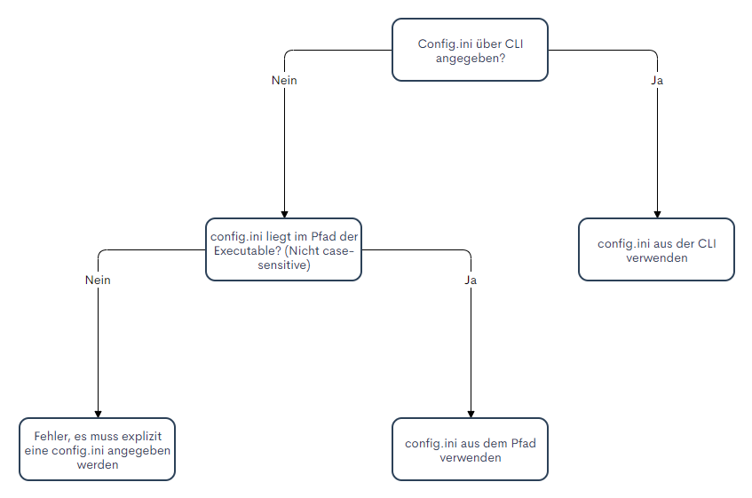
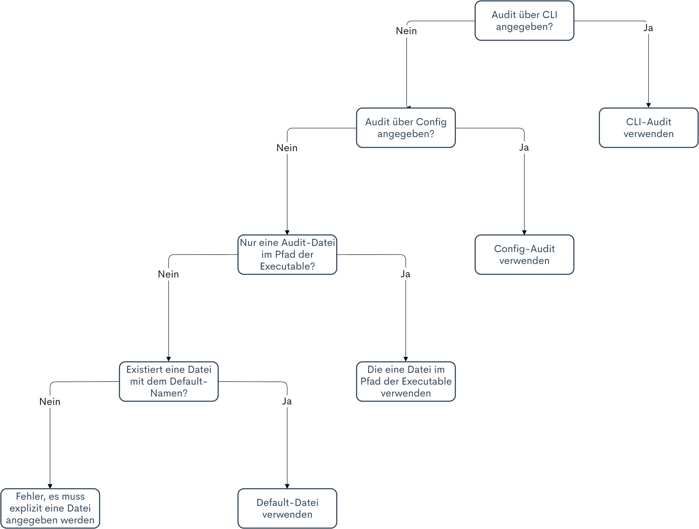

# Konfiguration des Jungbusch-Auditoriums

Es gibt zwei Möglichkeiten um Einfluss auf die Programmkonfiguration des JBA zu nehmen: Entweder durch Commandline-Parameter und/oder durch eine Konfigurations-Datei `(ini)`.

Priorität der Konfigurations-Werten (von bedeutsam zu unbedeutsam):

1. Commandline-Parameter
2. Konfigurations-Datei
3. Default-Werte

Das bedeutet, dass bei Werten, die sowohl in der Konfigurations-Datei, als auch per Commandline-Parameter angegeben werden, immer **der Wert des Commandline-Parameters** verwendet wird.

Es ist keinerlei Konfiguration zwingend notwendig um das Programm zu starten und erfolgreich ein Audit durchzuführen. Werden Werte nicht explizit vom Nutzer angegeben, fällt das Programm auf [Default-Werte](#default-werte) zurück.

## Pfade
Pfade können entweder `absolut` oder `relativ zum Pfad der Executable` angeben werden.

> Es wird **nicht** von der Working-Directory ausgegangen!

## Default-Werte

- Konfigurations-Datei --- Siehe Flowchart: [Auswahl der Konfigurations-Datei](#auswahl-der-konfigurations-datei-config.ini)
- Audit-Datei --- Siehe Flowchart: [Auswahl der Audit-Datei](#auswahl-der-audit-konfigurations-datei-.jba)
- Output-Pfad: `./` - Das bedeutet, dass wenn nicht anders angegeben, im Pfad der Executable ein Ordner mit dem Namen `jba-result` und einem Zeitstempel erstellt wird.
- Log-Verbosity: 3, Information (siehe [Log](#log))
- Konsolen-Verbosity: 2, Warning (siehe [Log](#log))

## Konfiguration per Commandline

Das Commandline-Interface `(CLI)` ist eine der Möglichkeiten des Jungbusch-Auditoriums `(JBA)` um die Software vor ihrem Start zu konfigurieren. 

### Erlaubter Syntax
- parameter=wert  
- parameter="wert"
- parameter wert (Nur bei Non-Booleans)
- parameter (Nur bei Booleans)

Alle Schreibweisen sind sowohl mit dem Prefix `-` als auch mit `--` erlaubt.

Die Commandline-Parameter selbst sind Case-Sensitive.

### Programmparameter
Folgende Parameter legen die Programm-Konfiguration fest:

#### -auditConfig, -a
Der Pfad zur Audit-Konfigurations-Datei. Die angegebene Datei muss vom Format `.jba` sein.
Wird dieser Parameter nicht angegeben, sucht das Jungbusch-Auditorium nach der Datei `audit.jba` oder verwendet eine `.jba` Datei mit beliebigem Name, solange diese Datei die einzige jba-Datei im Pfad der Executable ist. Siehe Flowchart: [Auswahl der Audit-Datei](#auswahl-der-audit-konfigurations-datei-.jba).

#### -config, -c
Der Pfad zur Konfigurations-Datei. Die angegebene Datei muss vom Format `.jba` sein. 
Wird dieser Parameter nicht angegeben, sucht das Jungbusch-Auditorium nach der Datei `config.ini` im Pfad der Executable. Siehe Flowchart: [Auswahl der Konfigurations-Datei](#auswahl-der-konfigurations-datei-config.ini).

#### -outputPath, -o
Der Pfad zur Output-Directory. Am angegebenen Pfad erstellt das Jungbusch-Auditorium einen Ordner mit dem Namen `jba-result` inklusive Zeitstempel, welcher Ergebnisse, Logs und Artefakte enthält.

#### -verbosityLog, -vl
Legt fest, wie viele Informationen in die Log-Datei geschrieben werden. Das Level wird als Zahl angegeben.

Siehe auch: [Log](#log)

#### -verbosityCommandline, -vc
Legt fest, wie viele Informationen auf der Konsole ausgegeben werden. Das Level wird als Zahl angegeben.

Siehe auch: [Log](#log)

#### -keepConsoleOpen
Mit diesem Parameter kann erreicht werden, dass die Konsole nach eigentlichem Beenden des Programms offen bleibt, bis `Enter` gedrückt wird. Dies ermöglicht es dem Nutzer, die Executable per Doppelklick auszuführen, da sich ohne diesen Parameter das Fenster sofort schließt und man so einen möglicherweise aufgetretenen Fehler nicht rechtzeitig erfassen könnte. Dieser Parameter macht nur in der [Konfigurations-Datei](#konfiguration-per-konfigurations-datei) Sinn.

#### -skipModuleCompatibilityCheck
Mit diesem Parameter kann die interne Modul-Kompatibilitätsüberprüfung übersprungen werden. Die einzelnen Module legen für sich selbst fest, mit welcher Art von Betriebssystemen oder spezifisch mit welcher Version eines OS sie kompatibel sind. Befindet sich das Betriebssystem des ausführenden Rechners nicht in dieser Liste, wird das Modul nicht geladen. Wird ein nicht geladenes Modul in der Audit-Konfigurations-Datei verwendet, bricht das Programm beim Parsen der Konfiguration mit einem entsprechenden Fehler ab.

#### -forceOS
Mit diesem Parameter kann das Ergebnis des OS-Detectors überschrieben werden. Dieses wird verwendet um die Kompatibilität der Module zu überprüfen. Der Parameter kann beispielsweise verwendet werden, wenn man den Syntax einer Audit-Konfigurationsdatei auf einem anderen System als dem Zielrechner testen will. Im Gegensatz zu `skipModuleCompatibilityCheck` wird allerdings die Kompatibilitätsüberprüfung mit dem hier gesetzten Betriebssystem wie gewohnt durchgeführt. 

#### -ignoreMissingPrivileges
Mit diesem Parameter kann festgelegt werden, dass fehlende Privilegien ignoriert werden und das JBA alle Module soweit möglich ausführt. Siehe [Privilegien](#privilegien).

#### -alwaysPrintProgress
Gibt den Fortschritt des Auditoriums beim Ausführen der Audit-Schritte auf der Konsole unabhängig vom angegebenen Log-Level aus.

#### -zip
Wird dieser Parameter angegeben, dann wird vom Output-Ordner ein zip-Archiv erzeugt.

#### -zipOnly
Wird dieser Parameter angegeben, dann wird vom Output-Ordner ein zip-Archiv erzeugt. Der Output-Ordner wird daraufhin entfernt, sodass als Ergebnis nur die zip bleibt.

### Parameter ohne Programmstart
Folgende Parameter geben Informationen auf der Konsole aus, führen den Rest des Programms aber nicht vollständig aus. Es gilt zu beachten, dass die Ausgaben dieser Parameter sowohl auf die Konsole, als auch in den Log geschrieben werden, unabhängig von dem angegebenen Log-Level.

#### -help
Dieser Parameter zeigt die Hilfe-Seite an.

#### -version
Wird dieser Parameter angegeben, wird die interne Version und das Datum der letzten Änderung des Jungbusch-Auditoriums ausgegeben.

#### -createDefault
Mit diesem Parameter kann eine `config.ini`-Datei im Pfad der Executable erzeugt werden, welche die Default-Werte des Jungbusch-Auditoriums beinhaltet. Die Werte der Datei können nach Belieben angepasst werden und werden beim Starten der Software automatisch eingelesen.

#### -showModules
Dieser Parameter gibt eine Liste mit allen Modulen aus, die sich in der ausgeführten Executable befinden. Es gilt zu beachten, dass Module die ausschließlich mit beispielsweise Linux kompatibel sind sich aufgrund der Funktionsweise von GO nicht in der Executable von Windows befinden. Wird dieser Parameter an einer .exe angegeben, werden alle Module aufgeführt, die mit der Windows-Architektur kompatibel sind.

#### -showModuleInfo
Dieser Parameter gibt alle verfügbaren Informationen zu dem angegeben Modul-Name aus. Es gilt dieselbe Einschränkung wie bei `-showModules`. Beispiel: `-showModuleInfo=grep`

#### -checkSyntax, -syntax
Mit diesem Parameter kann der Syntax der Audit-Konfigurationsdatei überprüft werden, ohne dass die Audit-Schritte ausgeführt werden. Es wird allein der Syntax der Datei überprüft. Angegebene Werte oder Variablen werden nicht validiert. Das heißt, es wird beispielsweise nicht überprüft, ob die IDs der Audit-Schritte einzigartig ist. Es ist also möglich, dass der Syntax valide ist, die Audit-Konfigurationsdatei aber nicht. Es gilt zu beachten, dass die Programm-Konfiguration (.ini, Commandline-Parameter) ebenfalls überprüft werden und gültig sein müssen um bei der Überprüfung des Syntaxes der Audit-Konfiguration überhaupt anzukommen.

#### -checkConfiguration
Mit diesem Parameter können der Syntax und die Werte der Audit-Konfigurationsdatei überprüft werden, ohne dass die Audit-Schritte ausgeführt werden. Es gilt zu beachten, dass das Ausführen dieses Checks für eine Windows-Konfiguration auf einem Linuxbasierten System keinen Sinn ergibt, weil in der Konfiguration ggf. `"Windows-Only-Module"` verwendet werden, die sich nicht in der Linux-Executable befinden und die Konfiguration damit möglicherweise nicht erfolgreich validiert werden kann. Es kann also sein, dass eine gültige Linux-Konfiguration auf einem Windows-System als nicht valide markiert wird. Es gilt zu beachten, dass die Programm-Konfiguration (.ini, Commandline-Parameter) ebenfalls überprüft werden und gültig sein müssen um bei der Überprüfung der Audit-Konfiguration überhaupt anzukommen.

#### -saveConfiguration, -s
Mit diesem Befehl wird die `config.ini` dauerhaft mit den zum aktuellen Start angegebenen Commandline-Parametern überschrieben.

Beispiel: `-outputPath /var/jba/ -save`

Das Programm startet, die `config.ini` wird eingelesen, der OutputPath wird auf `/var/jba/` gesetzt und die Änderung wird in die `config.ini` Datei geschrieben. Anschließend beginnt der Audit Prozess.

## Konfiguration per Konfigurations-Datei

Wenn man die Konfiguration des Programms festhalten will, sodass nicht bei jedem Programmstart Commandline-Parameter angegeben werden müssen, bietet es sich an, eine `config.ini` Datei zu erstellen. 

Die Konfigurationsdatei verwendet dieselbe Liste an Parametern wie die Commandline. Allerdings gibt es einige kleine Unterschiede im Syntax:

- In der Konfigurationsdatei sind Parameter ohne `-` oder `--` anzugeben
- Alle Parameter müssen im Format `name=wert` angegeben werden, auch Booleans
- In der Konfigurationsdatei können keine Aliase (Kurzversionen) der Parameter angegeben werden
- Bei Parameternamen wird die Groß- und Kleinschreibung nicht berücksichtigt

Davon abgesehen können alle Parameter der Commandline in der Konfigurations-Datei angegeben werden.

Mit dem Commandline-Flag `-createDefault` kann eine Beispiel-Konfigurationsdatei generiert werden, die daraufhin einfach editiert werden kann.

### Auswahl der Konfigurations-Datei (config.ini)

Theoretisch können auch mehrere Konfigurations-Dateien mit unterschiedlichen Werten angelegt werden. Welche Datei verwendet werden soll, muss dann allerdings über den Commandline-Parameter `-configPath` definiert werden.

Wird kein Parameter angegeben, dann wird im Pfad der Executable nach einer Datei mit dem Namen `config.ini` gesucht (Name der Datei in diesem Fall nicht Case-Sensitive). 



### config.ini Beispiel

```ini
[ENVIRONMENT]
AuditConfig=./audit.jba
OutputPath=.
VerbosityLog=3
VerbosityConsole=4
SkipModuleCompatibilityCheck=false
KeepConsoleOpen=false
IgnoreMissingPrivileges=false
AlwaysPrintProgress=false
Zip=false
ZipOnly=false
Version=false
CheckConfiguration=false
CheckSyntax=false
```

## Auswahl der Audit-Konfigurations-Datei (.jba)

Der Pfad zu einer Audit-Konfigurationsdatei kann sowohl über einen Commandline- als auch per Configparameter angegeben werden. Wird keine Datei explizit angegeben, überprüft das Jungbusch-Auditorium, welche JBA-Dateien im Pfad der Executable liegen. Liegt dort nur eine einzelne Datei, wird diese verwendet. Liegen dort mehrere Dateien, wird die Datei verwendet, welche den Default-Namen hat (`audit.jba`). Existiert diese nicht, wird das Jungbusch-Auditorium beendet.



