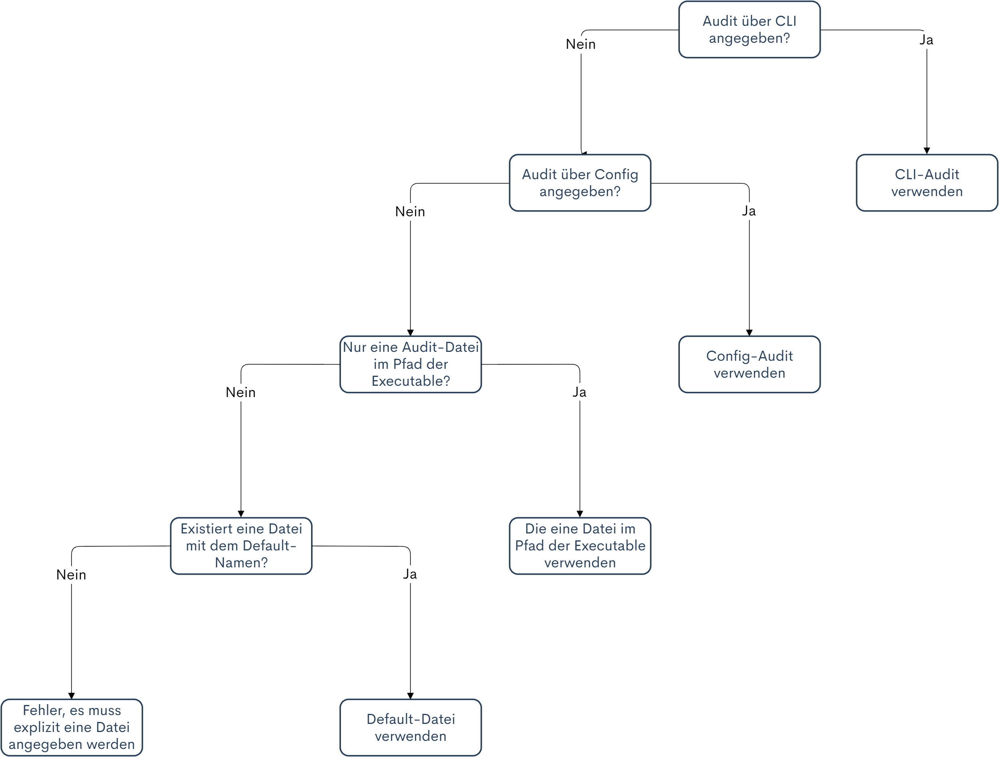

# Jungbusch-Auditorium: Handbuch

Dieses Repository enthält das Handbuch für das Jungbusch-Auditorium. Für eine HTML/PDF-Version, siehe [Releases](https://github.com/Jungbusch-Softwareschmiede/jungbusch-manual/releases). Für zugehörige Repositories, siehe [Jungbusch-Overview](https://github.com/Jungbusch-Softwareschmiede/jungbusch-overview).

----

# Einleitung

Dies ist das Benutzerhandbuch für das Jungbusch-Auditorium.
Das Jungbusch-Auditorium `(JBA)` ist ein Framework, welches das Durchführen eines Sicherheitsaudits auf einer Maschine erleichtern soll. 

Es wurde spezifisch für die Auslieferung an einen Kunden designed. Das bedeutet, dass die Software vollständig konfiguriert ausgeliefert werden kann und daraufhin keinerlei Nutzereingaben, angeben von Commandline-Parametern oder sonstige Konfiguration mehr benötigt. 

Das JBA wird mit einer Vielzahl an Modulen für viele bekannte Betriebssysteme und Architekturen ausgeliefert, welche häufig verwendete Funktionalität zur leichten Verwendung verallgemeinern. Außerdem ist das Erstellen von nutzereigenen Modulen in Golang möglich, ohne dass Code des Frameworks selbst angepasst werden muss.

Für das Definieren von Audit-Schritte wurde das JSON-ähnliche `.jba`-Dateiformat entwickelt, in welchem Auditschritte definiert, verschachtelt und mit Variablen oder Bedingungen untereinander verknüpft werden können. 

Sobald alle Audit-Schritte abgeschlossen sind, wird eine detailreiche Output-Datei erstellt, welche nicht nur die Ergebnisse sammelt, sondern vor Allem auch mit dem Ziel entworfen wurde, die Ergebnisse nachvollziehbar zu machen. Um dies zu erreichen sammelt das Jungbusch-Auditorium jegliche Artefakte, die beim Ausführen der Schritte verwendet wurden. Dies beeinhaltet ausgelesene Dateien, ausgeführte Konsolen-Befehle und Systemcalls.

# Glossar

## Konfiguration
Die **Konfiguration** (Config, Config.ini, Programmkonfiguration) ist die `.ini`-Datei in welcher die Programm-Konfiguration gespeichert werden kann. Die Config-Datei ist die Alternative zum [CLI](#commandline-interface). Diese Datei ist nicht zwingend anzugeben.

## Commandline-Interface
Das **Commandline-Interface** (CLI) ist die Programmkonfiguration per Konsole durch das angeben von Parametern.

## Audit-Konfiguration
Die **Audit-Konfiguration** (Audit-Config, DotJBA) enthält den gesamte Ablauf des durchzuführenden Audits. Sie besteht jeweils aus einem oder mehreren [Audit-Schritt](#audit-schritt)en. 

## Audit-Schritt
Ein **Audit-Schritt**, oder auch **Audit-Modul**, ist ein einzelner in der [Audit-Konfiguration](#audit-konfiguration) definierter Schritt. 

## Modul
Ein Modul ist ein austauschbarer Programmteil im Jungbusch-Auditorium. "Austauschbar" bedeutet, dass Module unabhängig vom [Framework](#framework) entfernt und hinzugefügt werden können. Module werden aus der [Audit-Konfiguration](#audit-konfiguration) aufgerufen, erwarten Eingabeparameter und führen dann Kommandos oder System-Calls aus, oder lesen Dateien ein. Auf ihr Ergebnis kann in der Audit-Konfiguration per Variable zugegriffen werden und es wird automatisch in die Ergebnis-Datei geschrieben. Des Weiteren merkt sich jedes Modul selbst, welche Artefakte es verwendet hat. Später werden diese von allen Modulen gesammelt, sortiert und abgespeichert.

## Framework
Das Framework ist im Falle des `Jungbusch-Auditoriums` alles außer den Modulen. Unter anderem das Commandline-Interface, der OS-Detector sowie der Parser und Interpreter der Audit-Konfiguration.

# Konfiguration des Jungbusch-Auditoriums

Es gibt zwei Möglichkeiten um Einfluss auf die Programmkonfiguration des JBA zu nehmen: Entweder durch Commandline-Parameter und/oder durch eine Konfigurations-Datei `(ini)`.

Priorität der Konfigurations-Werten (von bedeutsam zu unbedeutsam):

1. Commandline-Parameter
2. Konfigurations-Datei
3. Default-Werte

Das bedeutet, dass bei Werten, die sowohl in der Konfigurations-Datei, als auch per Commandline-Parameter angegeben werden, immer **der Wert des Commandline-Parameters** verwendet wird.

Es ist keinerlei Konfiguration zwingend notwendig um das Programm zu starten und erfolgreich ein Audit durchzuführen. Werden Werte nicht explizit vom Nutzer angegeben, fällt das Programm auf [Default-Werte](#default-werte) zurück.

## Pfade
Pfade können entweder `absolut` oder `relativ zum Pfad der Executable` angeben werden.

> Es wird **nicht** von der Working-Directory ausgegangen!

## Default-Werte

- Konfigurations-Datei --- Siehe Flowchart: [Auswahl der Konfigurations-Datei](#auswahl-der-konfigurations-datei-config.ini)
- Audit-Datei --- Siehe Flowchart: [Auswahl der Audit-Datei](#auswahl-der-audit-konfigurations-datei-.jba)
- Output-Pfad: `./` - Das bedeutet, dass wenn nicht anders angegeben, im Pfad der Executable ein Ordner mit dem Namen `jba-result` und einem Zeitstempel erstellt wird.
- Log-Verbosity: 3, Information (siehe [Log](#log))
- Konsolen-Verbosity: 2, Warning (siehe [Log](#log))

## Konfiguration per Commandline

Das Commandline-Interface `(CLI)` ist eine der Möglichkeiten des Jungbusch-Auditoriums `(JBA)` um die Software vor ihrem Start zu konfigurieren. 

### Erlaubter Syntax
- parameter=wert  
- parameter="wert"
- parameter wert (Nur bei Non-Booleans)
- parameter (Nur bei Booleans)

Alle Schreibweisen sind sowohl mit dem Prefix `-` als auch mit `--` erlaubt.

Die Commandline-Parameter selbst sind Case-Sensitive.

### Programmparameter
Folgende Parameter legen die Programm-Konfiguration fest:

#### -auditConfig, -a
Der Pfad zur Audit-Konfigurations-Datei. Die angegebene Datei muss vom Format `.jba` sein.
Wird dieser Parameter nicht angegeben, sucht das Jungbusch-Auditorium nach der Datei `audit.jba` oder verwendet eine `.jba` Datei mit beliebigem Name, solange diese Datei die einzige jba-Datei im Pfad der Executable ist. Siehe Flowchart: [Auswahl der Audit-Datei](#auswahl-der-audit-konfigurations-datei-.jba).

#### -config, -c
Der Pfad zur Konfigurations-Datei. Die angegebene Datei muss vom Format `.jba` sein. 
Wird dieser Parameter nicht angegeben, sucht das Jungbusch-Auditorium nach der Datei `config.ini` im Pfad der Executable. Siehe Flowchart: [Auswahl der Konfigurations-Datei](#auswahl-der-konfigurations-datei-config.ini).

#### -outputPath, -o
Der Pfad zur Output-Directory. Am angegebenen Pfad erstellt das Jungbusch-Auditorium einen Ordner mit dem Namen `jba-result` inklusive Zeitstempel, welcher Ergebnisse, Logs und Artefakte enthält.

#### -verbosityLog, -vl
Legt fest, wie viele Informationen in die Log-Datei geschrieben werden. Das Level wird als Zahl angegeben.

Siehe auch: [Log](#log)

#### -verbosityCommandline, -vc
Legt fest, wie viele Informationen auf der Konsole ausgegeben werden. Das Level wird als Zahl angegeben.

Siehe auch: [Log](#log)

#### -keepConsoleOpen
Mit diesem Parameter kann erreicht werden, dass die Konsole nach eigentlichem Beenden des Programms offen bleibt, bis `Enter` gedrückt wird. Dies ermöglicht es dem Nutzer, die Executable per Doppelklick auszuführen, da sich ohne diesen Parameter das Fenster sofort schließt und man so einen möglicherweise aufgetretenen Fehler nicht rechtzeitig erfassen könnte. Dieser Parameter macht nur in der [Konfigurations-Datei](#konfiguration-per-konfigurations-datei) Sinn.

#### -skipModuleCompatibilityCheck
Mit diesem Parameter kann die interne Modul-Kompatibilitätsüberprüfung übersprungen werden. Die einzelnen Module legen für sich selbst fest, mit welcher Art von Betriebssystemen oder spezifisch mit welcher Version eines OS sie kompatibel sind. Befindet sich das Betriebssystem des ausführenden Rechners nicht in dieser Liste, wird das Modul nicht geladen. Wird ein nicht geladenes Modul in der Audit-Konfigurations-Datei verwendet, bricht das Programm beim Parsen der Konfiguration mit einem entsprechenden Fehler ab.

#### -forceOS
Mit diesem Parameter kann das Ergebnis des OS-Detectors überschrieben werden. Dieses wird verwendet um die Kompatibilität der Module zu überprüfen. Der Parameter kann beispielsweise verwendet werden, wenn man den Syntax einer Audit-Konfigurationsdatei auf einem anderen System als dem Zielrechner testen will. Im Gegensatz zu `skipModuleCompatibilityCheck` wird allerdings die Kompatibilitätsüberprüfung mit dem hier gesetzten Betriebssystem wie gewohnt durchgeführt. 

#### -ignoreMissingPrivileges
Mit diesem Parameter kann festgelegt werden, dass fehlende Privilegien ignoriert werden und das JBA alle Module soweit möglich ausführt. Siehe [Privilegien](#privilegien).

#### -alwaysPrintProgress
Gibt den Fortschritt des Auditoriums beim Ausführen der Audit-Schritte auf der Konsole unabhängig vom angegebenen Log-Level aus.

#### -zip
Wird dieser Parameter angegeben, dann wird vom Output-Ordner ein zip-Archiv erzeugt.

#### -zipOnly
Wird dieser Parameter angegeben, dann wird vom Output-Ordner ein zip-Archiv erzeugt. Der Output-Ordner wird daraufhin entfernt, sodass als Ergebnis nur die zip bleibt.

### Parameter ohne Programmstart
Folgende Parameter geben Informationen auf der Konsole aus, führen den Rest des Programms aber nicht vollständig aus. Es gilt zu beachten, dass die Ausgaben dieser Parameter sowohl auf die Konsole, als auch in den Log geschrieben werden, unabhängig von dem angegebenen Log-Level.

#### -help
Dieser Parameter zeigt die Hilfe-Seite an.

#### -version
Wird dieser Parameter angegeben, wird die interne Version und das Datum der letzten Änderung des Jungbusch-Auditoriums ausgegeben.

#### -createDefault
Mit diesem Parameter kann eine `config.ini`-Datei im Pfad der Executable erzeugt werden, welche die Default-Werte des Jungbusch-Auditoriums beinhaltet. Die Werte der Datei können nach Belieben angepasst werden und werden beim Starten der Software automatisch eingelesen.

#### -showModules
Dieser Parameter gibt eine Liste mit allen Modulen aus, die sich in der ausgeführten Executable befinden. Es gilt zu beachten, dass Module die ausschließlich mit beispielsweise Linux kompatibel sind sich aufgrund der Funktionsweise von GO nicht in der Executable von Windows befinden. Wird dieser Parameter an einer .exe angegeben, werden alle Module aufgeführt, die mit der Windows-Architektur kompatibel sind.

#### -showModuleInfo
Dieser Parameter gibt alle verfügbaren Informationen zu dem angegeben Modul-Name aus. Es gilt dieselbe Einschränkung wie bei `-showModules`. Beispiel: `-showModuleInfo=grep`

#### -checkSyntax, -syntax
Mit diesem Parameter kann der Syntax der Audit-Konfigurationsdatei überprüft werden, ohne dass die Audit-Schritte ausgeführt werden. Es wird allein der Syntax der Datei überprüft. Angegebene Werte oder Variablen werden nicht validiert. Das heißt, es wird beispielsweise nicht überprüft, ob die IDs der Audit-Schritte einzigartig ist. Es ist also möglich, dass der Syntax valide ist, die Audit-Konfigurationsdatei aber nicht. Es gilt zu beachten, dass die Programm-Konfiguration (.ini, Commandline-Parameter) ebenfalls überprüft werden und gültig sein müssen um bei der Überprüfung des Syntaxes der Audit-Konfiguration überhaupt anzukommen.

#### -checkConfiguration
Mit diesem Parameter können der Syntax und die Werte der Audit-Konfigurationsdatei überprüft werden, ohne dass die Audit-Schritte ausgeführt werden. Es gilt zu beachten, dass das Ausführen dieses Checks für eine Windows-Konfiguration auf einem Linuxbasierten System keinen Sinn ergibt, weil in der Konfiguration ggf. `"Windows-Only-Module"` verwendet werden, die sich nicht in der Linux-Executable befinden und die Konfiguration damit möglicherweise nicht erfolgreich validiert werden kann. Es kann also sein, dass eine gültige Linux-Konfiguration auf einem Windows-System als nicht valide markiert wird. Es gilt zu beachten, dass die Programm-Konfiguration (.ini, Commandline-Parameter) ebenfalls überprüft werden und gültig sein müssen um bei der Überprüfung der Audit-Konfiguration überhaupt anzukommen.

#### -saveConfiguration, -s
Mit diesem Befehl wird die `config.ini` dauerhaft mit den zum aktuellen Start angegebenen Commandline-Parametern überschrieben.

Beispiel: `-outputPath /var/jba/ -save`

Das Programm startet, die `config.ini` wird eingelesen, der OutputPath wird auf `/var/jba/` gesetzt und die Änderung wird in die `config.ini` Datei geschrieben. Anschließend beginnt der Audit Prozess.

## Konfiguration per Konfigurations-Datei

Wenn man die Konfiguration des Programms festhalten will, sodass nicht bei jedem Programmstart Commandline-Parameter angegeben werden müssen, bietet es sich an, eine `config.ini` Datei zu erstellen. 

Die Konfigurationsdatei verwendet dieselbe Liste an Parametern wie die Commandline. Allerdings gibt es einige kleine Unterschiede im Syntax:

- In der Konfigurationsdatei sind Parameter ohne `-` oder `--` anzugeben
- Alle Parameter müssen im Format `name=wert` angegeben werden, auch Booleans
- In der Konfigurationsdatei können keine Aliase (Kurzversionen) der Parameter angegeben werden
- Bei Parameternamen wird die Groß- und Kleinschreibung nicht berücksichtigt

Davon abgesehen können alle Parameter der Commandline in der Konfigurations-Datei angegeben werden.

Mit dem Commandline-Flag `-createDefault` kann eine Beispiel-Konfigurationsdatei generiert werden, die daraufhin einfach editiert werden kann.

### Auswahl der Konfigurations-Datei (config.ini)

Theoretisch können auch mehrere Konfigurations-Dateien mit unterschiedlichen Werten angelegt werden. Welche Datei verwendet werden soll, muss dann allerdings über den Commandline-Parameter `-configPath` definiert werden.

Wird kein Parameter angegeben, dann wird im Pfad der Executable nach einer Datei mit dem Namen `config.ini` gesucht (Name der Datei in diesem Fall nicht Case-Sensitive). 


### config.ini Beispiel

```ini
[ENVIRONMENT]
AuditConfig=./audit.jba
OutputPath=.
VerbosityLog=3
VerbosityConsole=4
SkipModuleCompatibilityCheck=false
KeepConsoleOpen=false
IgnoreMissingPrivileges=false
AlwaysPrintProgress=false
Zip=false
ZipOnly=false
Version=false
CheckConfiguration=false
CheckSyntax=false
```

## Auswahl der Audit-Konfigurations-Datei (.jba)

Der Pfad zu einer Audit-Konfigurationsdatei kann sowohl über einen Commandline- als auch per Configparameter angegeben werden. Wird keine Datei explizit angegeben, überprüft das Jungbusch-Auditorium, welche JBA-Dateien im Pfad der Executable liegen. Liegt dort nur eine einzelne Datei, wird diese verwendet. Liegen dort mehrere Dateien, wird die Datei verwendet, welche den Default-Namen hat (`audit.jba`). Existiert diese nicht, wird das Jungbusch-Auditorium beendet.



# Betriebssysteme

## Der OS-Detector

Das Jungbusch-Auditorium erkennt das Betriebssystem des auszuführenden Systems automatisch. Das Ergebnis des Detectors kann mit einem Parameter überschrieben werden.

## OS-Kompatibilität in Modulen

Die einzelnen Module geben in ihrer `Initialize`-Methode eine Liste an kompatiblen Betriebssystemen an. Ein Modul ist zum Aufruf aus der Audit-Konfiguration nur verfügbar, wenn sich das aktuelle Betriebssystem in der Liste der Betriebssysteme des Moduls befindet. 

Module können folgende Betriebssysteme angeben:
```
ubuntu
debian
centos
rhel               // RedHat
sles               // Suse
sles_sap           // Suse SAP

windows10          // beinhaltet alle Versionen von Windows10
windowsserver2012
windowsserver2016
windowsserver2020
windows8
windows7
windowsxp

macos11.0
macos10.15
macos10.14
```

### Wildcards

Des Weiteren können folgende Wildcards angegeben werden:
```
all
windows
linux
darwin
```
Damit kann ein Modul als kompatibel mit allen Systemen einer Gruppe markiert werden.

## Beeinflussen der Kompatibilitäts-Überprüfung 

Mit dem Flag `skipModuleCompatibilityCheck` kann der gesamte Modul-Kompatibilitätscheck übersprungen werden. Somit werden alle Module geladen, die mit der Architektur des Systems kompatibel sind. 

Mit dem Flag `forceOS` kann das Ergebnis des OS-Detectors überschrieben werden. 

# Privilegien

Das Jungbusch-Auditorium erkennt vor dem Ausführen von Audit-Schritten, ob es mit Root-Privilegien auf Linux, bzw. Administrator-Privilegien auf Windows ausgeführt wurde (nachfolgend der Lesbarkeit wegen Admin-Rechte genannt). Dies wird gemacht, damit festgestellt werden kann, ob das Jungbusch-Auditorium für das Ausführen aller Audit-Schritte ausreichende Rechte hat. Nachfolgend werden die vier möglichen Fälle erläutert:

1. In der Audit-Konfiguration sind **keine** Module definiert, die Admin-Rechte benötigen. Der Prozess wurde **nicht** mit Admin-Rechten gestartet. 
Das Auditorium wird wie gewohnt ausgeführt.

2. In der Audit-Konfiguration sind **keine** Module definiert, die Admin-Rechte benötigen. Der Prozess wurde mit Admin-Rechten gestartet. 
Es wird eine Warnung ausgegeben, welche je nach eingestelltem Verbosity-Level auf der Konsole ausgegeben und in den Log geschrieben wird. Das Auditorium wird davon abgesehen wie gewohnt ausgeführt.

3. In der Audit-Konfiguration sind Module definiert, die Admin-Rechte benötigen. Der Prozess wurde **nicht** mit Admin-Rechten gestartet. 
Es wird ein Error ausgegeben und das Jungbusch-Auditorium beendet, außer in der Programmkonfiguration wurde der Parameter `ignoreMissingPrivileges` gesetzt.

4. In der Audit-Konfiguration sind Module definiert, die Admin-Rechte benötigen. Der Prozess wurde mit Admin-Rechten gestartet. 
Das Auditorium wird wie gewohnt ausgeführt.

## Funktionsweise

Auf Unix-Systemen wird die effektive ID des Prozesses (EGID) abgefragt.

Auf Windows-Systemen wird überprüft ob `\\\\.\\PHYSICALDRIVE0` vom Prozess zugreifbar ist. Das Privilegien-System von Windows ist leider mit unterschiedlichen Arten von privilegierten Konten etwas kompliziert, dessen Umsetzung befindet sich aber außerhalb des Fokus für das Auditorium.

# Log

Der Log ist neben dem Ergebnis die einzige Möglichkeit für den Benutzer um nachzuverfolgen, was das Jungbusch-Auditorium konkret macht. Der `Logger` ist zuständig für die Konsolenausgaben, aber auch für das Schreiben einer Log-Datei. Die Log-Datei wird im [Output](todo)-Ordner des Auditoriums abgelegt. 

## Ausgabe-Stufen

Das Jungbusch-Auditorium bietet fünf unterschiedliche Verbosity-Stufen, die über Parameter gesetzt werden können:

0 = NONE  
1 = ERROR  
2 = WARNING  
3 = INFO  
4 = DEBUG  

Bei der Stufe `NONE` wird überhaupt nichts ausgegeben. Es empfiehlt sich, diese Stufe maximal für die Konsole anzugeben.

Bei der Stufe `ERROR` werden ausschließlich die Nachrichten kritischer Fehler ausgegeben. Tritt ein kritischer Fehler auf, ist die weitere Ausführung des Programms nicht möglich.

Bei der Stufe `WARNING` werden die Nachrichten kritischer Fehler und Warnungen ausgegeben. Eine Warnung wird beispielsweise dann ausgegeben, wenn das Programm möglicherweise nicht korrekt konfiguriert ist, oder ein Fehler auftritt, der aber innerhalb des Programms behandelt werden kann.

Bei der Stufe `INFO` werden die Nachrichten kritischer Fehler, Warnungen und zusätzliche Informationen ausgegeben, wie beispielsweise in welchem Programmteil sich der Prozess befindet und welche Schritte aktuell abgearbeitet werden.

Bei der Stufe `DEBUG` werden die Nachrichten aller vorherigen Stufen, sowie eine Vielzahl von zusätzlichen Informationen ausgegeben. Diese können dafür verwendet werden, Fehler in Modulen oder im Rest des Frameworks zu identifizieren.

## Auftreten eines Fehlers vor Initialisierung des Loggers
 
Bevor der Logger initialisiert werden kann, muss die Programmkonfiguration eingelesen und der Output-Ordner erstellt werden. In diesen Programmteilen können möglicherweise bereits unerwartete Fehler auftreten (beispielsweise durch einen ungültigen Output-Pfad in der Konfigurationsdatei). In diesem Fall versucht das Jungbusch-Auditorium trotzdem eine Log-Datei zu erstellen um sicherzustellen, dass der Benutzer den Fehler nachverfolgen kann.

Es wird versucht, Log-Dateien an unterschiedlichen Pfaden in der folgenden Reihenfolge zu erstellen. Schlägt dies Fehl, beispielsweise aufgrund von fehlenden Berechtigungen, wird der nächste Pfad probiert.

- Log-Datei im angegebenen Output-Ordner

- Log-Datei am Pfad der Executable

- Log-Datei in der Working-Directory

- zusätzlich:

**Windows**:

- Log-Datei im Pfad `%appdata%\JungbuschAuditorium`

**Unix-Systeme**:

- Log-Datei im Pfad `/var/log/JungbuschAuditorium`

An welchem Pfad eine Log-Datei erstellt wurde, wird unabhängig vom Log-Level auf der Konsole ausgegeben. Konnte an keinem der Pfade eine Log-Datei erstellt werden, wird der aufgetretene Fehler unabhängig vom Log-Level auf der Konsole ausgegeben.

# Die Audit-Konfiguration

Die Audit-Konfigurationsdatei ist die wichtigste Schnittstelle des Jungbusch-Auditoriums. In ihr werden alle durchzuführenden Audit-Schritte definiert. Ihr Syntax wurde mit dem Ziel entworfen, dass sie übersichtlich und auch für außenstehende möglichst leicht verständlich ist. Ihr Syntax ist JSON-ähnlich.

## Audit-Schritte

Die Audit-Konfigurationsdatei (nachfolgend: Audit-Datei) besteht aus [Audit-Schritten](#audit-schritt). Der Syntax eines einzelnen Schritts wird nachfolgend anhand eines Beispiels beschrieben. 

```
{
    module:"FileContent"
    stepid:"3"
    description:"Ensure no legacy + entries exist in shadow"
    passed: if("%result% == ''")
	
	file:"/etc/shadow"
    grep:"^\+:"
},
```

Jeder Schritt steht in geschweiften Klammern, und wird mit einem Komma von dem darauffolgenden Schritt getrennt. In der ersten Zeile wird dafür das zu verwendende Modul aufgerufen, hier `FileContent`. Die `StepID` ist die einzigartige Erkennung des Schritts. Mit dem Parameter `description` kann eine kurze Beschreibung des Schritts definiert werden. Der Parameter `passed` legt fest, wann der Schritt als erfolgreich gilt (Siehe [Bedingungen](#bedingungen)). Die letzten beiden Parameter sind sogenannte `Modul-Parameter`. Jedes Modul erwartet unterschiedliche Eingabeparameter. 

Ein großer Teil aller Module hat den optionalen Parameter `grep`. Mit ihm kann das Ergebnis (`%result%`) des Moduls manipuliert werden, um das Überprüfen mit einer Bedingung zu vereinfachen.

## Parameter

- Groß- und Kleinschreibung wird bei den Parameternamen nicht berücksichtigt.

- Die Reihenfolge, in der die Parameter angegeben werden, macht keinen Unterschied.

- Schreibweise: `Name:"Wert"` (Ausnahme: [Bedingungen](#bedingungen)). 

- Zusätzlich zu den Parametern der Audit-Konfiguration selbst besitzt jedes Modul eigene Eingabe-Parameter. Siehe [Liste aller Module](#module-1).

### Ausführreihenfolge

Unabhängig davon, in welcher Reihenfolge die Parameter in der Audit-Konfiguration angegeben werden, wird ein Schritt immer in der selben Reihenfolge ausgeführt.

1. `Condition` - Es wird überprüft, ob die Ausführbedingung zutrifft

2. `Module` - Ausführen des Moduls

3. `Passed` - Es wird überprüft, ob die Passed-Bedingung zutrifft

4. `Print` - Wurde ein Print-Parameter spezifiziert, wird dieser ausgegeben

### Parameter der Audit-Konfiguration

#### module
- Name: module
- Alias: mod, modul
- Zwingend anzugeben: Ja
- Beschreibung: Mit diesem Parameter wird festgelegt, welches Modul der Audit-Schritt ausführen soll. Es gilt zu beachten, dass die Groß- und Kleinschreibung bei dem Name des Moduls berücksichtigt werden muss. Siehe [Liste aller Module](#module-1).

#### stepid
- Name: stepid
- Alias: stepidentification, id, identifikation
- Zwingend anzugeben: Ja
- Beschreibung: Die StepID ist die einzigartige Bezeichnung für den Schritt. Sie kann sowohl Zahlen als auch Zeichen enthalten. Sie ermöglicht die Zuordnung des Ergebnisses zu einem Audit-Schritt.

#### description
- Name: description
- Alias: desc, beschreibung, definition
- Zwingend anzugeben: Nein
- Beschreibung: Mit diesem Parameter kann eine Beschreibung gesetzt werden, die später sowohl im Log, als auch im Ergebnis wiederzufinden ist. 

#### passed
- Name: passed
- Alias: bestanden, erfolgreich
- Zwingend anzugeben: Nein
- Beschreibung: Mit diesem Parameter kann festgelegt werden, unter welcher Bedingung der Schritt als erfolgreich anzusehen ist. Wird `passed` nicht angegeben, ist der Schritt unabhängig vom Ergebnis erfolgreich, solange bei der Ausführung kein Fehler auftritt. Siehe auch: [Bedingungen](#bedingungen).

#### condition
- Name: condition
- Alias: cond, bedingung
- Zwingend anzugeben: Nein
- Beschreibung: Mit diesem Parameter kann eine Ausführ-Bedingung für den jeweiligen Audit-Schritt festgelegt werden. Der Schritt wird nur ausgeführt, wenn die angegebene Bedingung zutrifft. Siehe auch: [Bedingungen](#bedingungen).

#### requiresElevatedPrivileges
- Name: requiresElevatedPrivileges
- Alias: requiresAdmin, requiresRoot, requiresPrivileges, rootOnly, adminOnly
- Zwingend anzugeben: Nein
- Beschreibung: Mit diesem Parameter können die benötigten Privilegien eines Moduls überschrieben werden. Die einzelnen Module legen jeweils für sich selbst fest, ob sie zum Ausführen erhöhte Privilegien benötigen oder nicht. (Siehe [Liste aller Module](#module-1)). 

Allerdings gibt es Module, wie beispielsweise `FileContent`, welches den Inhalt der angegebenen Datei ausliest und für diese Aufgabe erstmal keine Privilegien benötigt. Möchte man allerdings beispielsweise `/etc/shadow` auslesen, benötigt man erhöhte Privilegien und sollte nun diesen Parameter auf `"true"` setzen. Wird der Parameter in solchen Fällen nicht korrekt angegeben, kann vor Starten der Ausführung der Audit-Schritte nicht sichergestellt werden, dass diese Fehlerfrei durchgeführt werden können. Weiterführende Informationen: [Privilegien](privilegien).

#### print
- Name: print
- Alias: ausgeben
- Zwingend anzugeben: Nein
- Beschreibung: Mit dem Print-Parameter können Text oder Variablen auf der Konsole und im Log ausgegeben werden. Der Print-Parameter wird verarbeitet, nachdem das Modul ausgeführt wurde. 

**Beispiel:** 
Ausgeben des Ergebnisses und des Passed-Werts

```print: "Modul-Ergebnis: %result%, Passed: %passed%"```

### Das Verwenden von Variablen in Parametern

Variablen können in Modul-Parametern verwendet werden. Sie können alleine oder zwischen anderem Text verwendet werden. Es gilt zu beachten, dass in jedem Fall um Modulparameter Anführungszeichen verwendet werden müssen. Der Name der Variable wird 1:1 mit ihrem gesetzten Wert ersetzt.

Siehe auch: [Variablen](#variablen).

**Beispiele:**
```
key: "HKEY_USERS\%sid%\Software\Policies\..."
sid: "%sid%"
```

## Bedingungen

Bedingungen werden im Jungbusch-Auditorium für den [Passed](#passed)- und [Condition](#condition)-Parameter verwendet. Bedingungen werden mit [GOJA](https://github.com/dop251/goja) ausgewertet und sind daher im ECMAScript 5.1-Syntax gehalten. Eine Bedingung muss in eine Zeile passen. Es können in der Auditkonfiguration deklarierte [Variablen](#variablen) verwendet werden.

Um Bedingungen können Anführungszeichen oder Backticks verwendet werden. Backticks haben den Vorteil, dass innerhalb der Bedingung weiterhin wie gewohnt Anführungszeichen verwendet werden können. Benutzt man um die Bedingung stattdessen Anführungszeichen, sollte man in der Bedingung selbst Hochkommas (`'`) verwenden.

```
passed: if("%result% >= '24'")
passed: if(`%result% >= "24"`)
```

### Das Verwenden von Variablen in Bedingungen

Variablen können auf unterschiedliche Arten in Bedingungen verwendet werden.

Das Jungbusch-Auditorium versucht, die Datentypen von Variablen zu erkennen und sie korrekt zu konvertieren. So kann man, vorausgesetzt das verwendete Modul gibt `true` oder `false` in seinem Ergebnis zurück, die `%result`-Variable selbst überprüfen:

```
passed: if("%result%")
```

Bei strings bietet es sich an, ECMAScript-Methoden wie beispielsweise `.includes()` zu verwenden: 

```
passed: if("%result%.includes('targeted')")
```

Zahlen werden ebenfalls konvertiert und können auf die gewohnte Art und Weise verglichen werden:

```
passed: if("%result% >= '24'")
```

### Multiline-Bedingungen

Mit dem [Script-Modul](#script) kann mehrzeiliger ECMAScript-Code ausgeführt werden. So können Werte beliebig bearbeitet werden und später in der Audit-Konfiguration weiterverwendet werden.

### Beispiele

Das Ergebnis eines Schritts wird als Bedingung für einen verschachtelten Schritt verwendet:

```
{
    module:"FileContent"
	...
    %auditrules% = %passed%
    {
        condition: if("%auditrules%")
        ...
    },
},
```

Zur Auswertung einer Passed-Bedingung wird ECMAScript-Syntax verwendet:

```
passed: if("%result%.includes('targeted') || %result%.includes('mls')")
```

```
passed: if("%result%.includes('= 0')")
```

```
passed: if("%result% == 'disabled'")
```

## Variablen

In der Audit-Konfiguration können neuen Variablen Werte zugewiesen werden, oder die Werte von Umgebungsvariablen beispielsweise in Bedingungen verwendet werden.

#### Syntax

Variablennamen werden immer von Prozentzeichen umschlossen, auch in Bedingungen. Einen Wert weist man ihnen mit einem `=`-Zeichen zu. Einer neuen Variable können die Werte von anderen Variablen, Umgebungsvariablen oder ein Wert in Anführungszeichen zugewiesen werden.

Eine einzelne Variable darf pro Schritt einmalig gesetzt werden. 

Variablennamen dürfen Buchstaben, Zahlen und `_` Unterstriche enthalten.

> **Vorsicht:** Bei Variablen ist die Groß- und Kleinschreibung nicht relevant. Das bedeutet, die Variable `%test%` und `%TesT` sind ein und dasselbe.

```
%myValue% = "Mein Wert"
%module_1_Result% = %result%
```

### Das Verwenden von Variablen

Variablen können im Script-Modul verwendet werden: [Script](#script)

Variablen können in Bedingungen verwendet werden: [Variablen in Bedingungen](#das-verwenden-von-variablen-in-bedingungen)

Variablen können in Parametern verwendet werden: [Verwendung von Variablen in Parametern](#das-verwenden-von-variablen-in-parametern)

### Umgebungsvariablen

Es stehen einige Umgebungsvariablen zur Verfügung, mit denen bspw. auf das Ergebnis eines Audit-Schritts zugegriffen werden kann. So kann man aus dem Ergebnis eine Bedingung bauen, sodass ein anderer Schritt nur ausgeführt wird, wenn diese zutrifft.

#### Sichtbarkeit von Umgebungsvariablen

Umgebungsvariablen sind, im Gegensatz zu herkömmlichen Variablen, nur in dem aktuellen Schritt gültig. Sie sind also nur innerhalb der geschweiften Klammern sichtbar und werden auch nicht an Kinder weitergegeben. Das bedeutet, dass wenn man den Wert einer Umgebungsvariable eines Schritts in dessen Kind verwenden möchte, man den Wert in eine herkömmliche Variable zwischenspeichern muss. Siehe [Beispiele](#beispiel-1).

#### %result%
In dieser Variable wird das Ergebnis des Schritts in Textform gespeichert. Es kann mit dem `grep`-Parameter, den viele Module implementieren, beeinflusst werden.

#### %passed%
Diese Variable ist entweder `true` oder `false`, je nachdem ob die `Passed`-Bedingung des Moduls zutrifft. Tritt beim Ausführen des Moduls ein Fehler auf (-> %unsuccessful% = `true`), dann ist Passed automatisch `false`.

#### %unsuccessful%
`true`, wenn die Ausführung des Moduls fehlgeschlagen ist. Umkehrschluss: Ist diese Variable `false`, dann wurde das Modul ohne Fehler ausgeführt.

#### %os%
Enthält das aktuelle Betriebssystem. Siehe [Betriebssysteme](#os-kompatibilität-in-modulen).

#### %currentmodule%
Enthält den Namen des aktuellen Moduls.

### Herkömmliche Variablen

#### Sichtbarkeit

Variablen eines Audit-Schritts sind für alle seine Kinder (also verschachtelte Module), sowie alle Kinder der Kinder sichtbar. 

```
{
	...
	%variable% = "wert"
	
	{
		...
		// sichtbar
		
		{
			...
			// sichtbar
			...
		},
		
		...
	},
	
	...
},

{
	...
	// Nicht sichtbar
},
```

#### Beispiel

```
{
	module:"FileContent"
	stepid: "5"
	description:"Ensure kernel module loading and unloading is collected"
	
	file:"/etc/audit/rules.d/audit.rules"
	grep:"modules"
	
	passed: if("%result% == '-w /sbin/insmod -p x -k modules\n-w /sbin/rmmod -p x -k modules\n-w /sbin/modprobe -p x -k modules\n-a always,exit -F arch=b64 -S init_module -S delete_module -k modules'")
	
	// Zwischenspeichern des Ergebnisses
	%auditrules% = %passed%
	
	{
		// Schritt wird nur ausgeführt, wenn die Passed-Bedingung des vorherigen Schritts zutrifft
		condition: if("%auditrules%")
	
		module:"Auditctl"
		stepid:"5.1"
		description:"Ensure kernel module loading and unloading is collected"
		
		grep:"modules"
		
		passed: if("%result% == '-w /sbin/insmod -p x -k modules\n-w /sbin/rmmod -p x -k modules\n-w /sbin/modprobe -p x -k modules\n-a always,exit -F arch=b64 -S init_module -S delete_module -k modules'")
	},
},
...
```

### Globale Variablen

Wenn die Verschachtelung der Module zum weitergeben der Variablen an Kinder keine Option ist, sondern bestimmte Werte über die gesamte Audit-Konfiguration verwendet werden, gibt es die Option der globalen Variablen. Diese können nur unter folgenden Bedingungen gesetzt werden:

1. Ein Audit-Schritt ist dann global, wenn er Variablen enthält, die den Prefix "%g_" haben.
2. Ein `globaler Schritt` darf nur der allererste Schritt in der Audit-Konfiguration sein.
3. Soll es mehrere globale Schritte geben, müssen sie, **ohne von non-globalen Schritten unterbrochen zu werden**, ebenfalls am Anfang der Datei stehen. Also: globale Schritte dürfen ausschließlich **vor** dem ersten non-globalem Schritt stehen.
4. Globale Schritte dürfen weder selbst verschachtelt sein, noch verschachtelte Schritte beeinhalten.

Die so definierten globale Variablen dürfen in non-globalen Schritten nur verwendet, aber nicht überschrieben werden (Read-Only).

#### Beispiel

Beispiel aus der Windows-Education JBA-Datei:

```
//
// Set global variables
//
{
	stepid: "0-DumpSecuritySettings"
	description: "Dump the current security-settings in a file."
	module: "DumpSecuritySettings"

	%g_dumpCreated% = %passed%
},
{
	stepid: "0-GetGuestName"
	description: "Get the name of the local guest account."
	module: "GetAccountName"

	typ: "Guest"
	%g_guest% = %result%
},
{
	stepid: "0-GetCurrentUsername"
	description: "Get the name of the current local user."
	module: "GetAccountName"

	typ: "User"
	%g_user% = %result%
},
{
	stepid: "0-GetSIDOfCurrentUser"
	description: "Get the SID of the current local user."
	module: "GetUserSID"

	userName: "%g_user%"
	%g_userSID% = %result%
},

//
// Start audit process
//
{
	condition: if("%g_dumpCreated%")
	stepid: "1.1.1"
    desc: "Ensure 'Enforce password history' is set to '24 or more password(s)' (Automated)"
    module: "SecuritySettingsQuery"

	valueName: "PasswordHistorySize"
	passed: if("%result% >= '24'")
},
...
```

# Module

## Inhaltsverzeichnis

**Für alle Architekturen:**

- [ExecuteCommand](#executecommand)

- [FileContent](#filecontent)

- [Grep](#grep)

- [IsFile](#isfile)

- [Permissions](#permissions)

- [Script](#das-script-modul)

**Linux:**

- [Auditctl](#auditctl)

- [Authselect](#authselect)

- [AwkScript](#awkscript)

- [BashScript](#bashscript)

- [CheckPartition](#checkpartition)

- [IsInstalled](#isinstalled)

- [IsNotInstalled](#isnotinstalled)

- [Modprobe](#modprobe)

- [NftListRuleset](#nftlistruleset)

- [Sshd](#sshd)

- [Stat](#stat)

- [Sysctl](#sysctl)

- [Systemctl](#systemctl)

**Windows:**

- [AuditPolicyQuery](#auditpolicyquery)

- [DumpSecuritySettings](#dumpsecuritysettings)

- [ExportInstalledSoftware](#exportinstalledsoftware)

- [GetAccountName](#getaccountname)

- [GetUserSID](#getusersid)

- [GetWinEnv](#getwinenv)

- [IsGPTemplatePresent](#isgptemplatepresent)

- [RegistryQuery](#registryquery)

- [SecuritySettingsQuery](#securitysettingsquery)

## Module für alle Architekturen

### ExecuteCommand

- Kompatibilität: all
- Alias: execute_command, executeCommand
- Beschreibung des Moduls: ExecuteCommand führt den übergebenen Befehl aus und überprüft optional, ob der angegebene Suchbegriff im Ergebnis vorhanden ist.
- Parameter:
	- command (cmd): Der auszuführende Befehl
	- grep: \[Optional\] Suchbegriff, entspricht dem Pipen des Outputs in grep
- Benötigt Admin-Rechte: Nein

### FileContent
- Kompatibilität: all
- Alias: file_content, fileContent
- Beschreibung des Moduls: FileContent gibt den Inhalt einer Datei als String zurück. Ist der grep-Parameter angegeben, werden die Zeilen zurückgegeben, in denen ein Match vorliegt.
- Parameter:
	- file (datei): Pfad zur Datei, die ausgelesen werden soll
	- grep: \[Optional\] Optionaler Suchbegriff, entspricht dem Pipen des Outputs in grep
- Benötigt Admin-Rechte: Nein

### Grep
- Kompatibilität: all
- Alias: grep
- Beschreibung des Moduls: Grep dient als Suchfunktion und kann in verschiedenen Modulen aufgerufen werde.
- Parameter:
  - input: Übergebener String, in dem gesucht werden soll
  - grep: Suchbegriff/Regex-Ausdruck
- Benötigt Admin-Rechte: Nein

### IsFile
- Kompatibilität: all
- Alias: isfile
- Beschreibung: IsFile prüft ob eine Datei existiert.
- Parameter:
	- path: Pfad zur Datei
- Benötigt Admin-Rechte: Nein

### Permissions
- Kompatibilität: all
- Alias: perms, permissions
- Beschreibung des Moduls: Permissions gibt die Berechtigungen der/des angegebenen Datei/Ordners zurück.
- Parameter:
	- path (pfad): Pfad der/des zu überprüfenden Datei/Ordners
- Benötigt Admin-Rechte: Nein

## Linux-Module

### Auditctl
- Kompatibilität: linux
- Alias: auditctl
- Beschreibung des Moduls: Mit Auditctl können die Kernel-Audit-Regeln ausgelesen werden.
- Parameter:
	- grep (name, modul): Suchbegriff, entspricht Pipen des Outputs in grep
- Benötigt Admin-Rechte: Ja

### Authselect
- Kompatibilität: rhel
- Alias: authselect
- Beschreibung des Moduls: Mit Authselect lässt sich die Konfiguration des authselect-Profils überprüfen.
- Parameter:
	- grep: \[Optional\] Suchbegriff, entspricht dem Pipen des Outputs in grep
- Benötigt Admin-Rechte: Nein

### AwkScript
- Kompatibilität: linux
- Alias: awk, awkScript, awk_script
- Beschreibung des Moduls: Awk ist eine Skriptsprache zum Editieren und Analysieren von Texten. AwkScript führt ein Skript auf die Input-Datei aus.
- Parameter:
	- input: String, auf den das Skript angewendet wird
	- awkscript (script): Awk-Script, welches ausgeführt werden soll
	- seperator: \[Optional\] Legt den Field-Separator fest
- Benötigt Admin-Rechte: Nein

### Bashscript
- Kompatibilität: linux
- Alias: bash_script, bashscript
- Beschreibung des Moduls: BashScript führt das verlinkte Bash-Script aus. Als Ergebnis wird der Output des Skripts erhalten.
- Parameter:
	- script: Der Pfad zum auszuführenden Bash-Script
- Benötigt Admin-Rechte: Nein

### CheckPartition
- Kompatibilität: linux
- Alias: checkPartition, mount
- Beschreibung des Moduls: CheckPartition gibt alle eingehängten Datenträger aus. Ist der grep-Parameter gesetzt, werden die Zeilen zurückgegeben, in denen das Pattern gefunden wurde.
- Parameter:
	- grep: \[Optional\] Optionaler Suchbegriff, entspricht dem Pipen des Outputs in grep
	- vgrep: \[Optional\] Optionaler Suchbegriff, entspricht dem Pipen des Outputs in grep -v
- Benötigt Admin-Rechte: Nein


### IsInstalled
- Kompatibilität: linux, darwin
- Alias: isInstalled, is_installed, installed
- Beschreibung des Moduls: IsInstalled überprüft, ob das angegebene Package installiert ist.
- Parameter:
	- package (name, packagename, pkg): Name des Packages
- Benötigt Admin-Rechte: Nein

### IsNotInstalled
- Kompatibilität: linux, darwin
- Alias: isNotInstalled, is_not_installed, notInstalled, not_installed
- Beschreibung des Moduls: IsNotInstalled überprüft, ob das angegebene Package nicht installiert ist.
- Parameter:
	- package (name, packagename, pkg): Name des Packages
- Benötigt Admin-Rechte: Nein

### Modprobe
- Kompatibilität: linux
- Alias: modprobe
- Beschreibung des Moduls: Modprobe simuliert das Laden des angegebenen Moduls zur Laufzeit des Systems und speichert das Ergebnis ausführlich ab. Daraufhin wird überprüft, ob das angegebene Modul aktuell geladen ist.
- Parameter:
	- modul (name): Name des Moduls
- Benötigt Admin-Rechte: Ja

### NftListRuleset
- Kompatibilität: linux
- Alias: nftListRuleset, nft_list_ruleset
- Beschreibung des Moduls: Mit NftListRuleset lässt sich das Ruleset von nftables analysieren.
- Parameter:
	- awk: \[Optional\] Optionales Skript
	- grep: Suchbegriff, entspricht dem Pipen des Outputs in grep
- Benötigt Admin-Rechte: Ja

### Sshd
- Kompatibilität: linux
- Alias: sshd
- Beschreibung des Moduls: Sshd liest die Informationen aus der sshd Config-Datei aus.
- Parameter:
	- grep: \[Optional\] Optionaler Suchbegriff, entspricht dem Pipen des Outputs in grep
- Benötigt Admin-Rechte: Nein

### Stat
- Kompatibilität: linux
- Alias: stat
- Beschreibung: Mit dem Befehl stat lassen sich Zugriffs- und Änderungszeitstempel von Dateien und Ordnern anzeigen. Weiterhin werden Informationen zu Rechten, Besitzer und Gruppe, sowie zu dem Dateityp ausgegeben.
- Parameter:
	- file (datei): Pfad zur Datei
- Benötigt Admin-Rechte: Ja

### Sysctl
- Kompatibilität: linux
- Alias: sysctl
- Beschreibung: Sysctl wird dazu verwendet, Kernelparameter zur Laufzeit zu ändern. Die verfügbaren Parameter sind unter `/proc/sys/` aufgelistet. Für die sysctl-Unterstützung in Linux ist Procfs notwendig. Sysctl kann sowohl zum Lesen als auch zum Schreiben von Sysctl-Daten verwendet werden.
- Parameter:
	- kernelparameter (kernelparam): Der Name des Schlüssels, aus dem gelesen werden soll.
- Benötigt Admin-Rechte: Nein

### Systemctl
- Kompatibilität: linux
- Alias: systemctl
- Beschreibung: Systemctl überprüft, ob die angegebene Unitdatei aktiviert ist.
- Parameter:
	- unitdatei (unitname): Name der Unitdatei
- Benötigt Admin-Rechte: Nein

## Windows Module

### AuditPolicyQuery
- Kompatibilität: windows
- Alias: auditpolicyquery, auditpol
- Beschreibung des Moduls: AuditPolicyQuery ermöglicht den Bereich 'Advanced Audit Policy Configuration' der Security Settings auszulesen.
- Parameter:
	- guid: GUID der jeweiligen Value. Bitte im Benutzerhandbuch oder Internet nachschlagen.
- Benötigt Admin-Rechte: Ja
- Weitere Informationen: **Achtung**: Die Ausgabe des Moduls ist von der jeweiligen  Systemsprache abhängig. Dies muss in der Auditconfig berücksichtigt werden.

Da die Richtlinien des Konfigurationsknoten `Computer Configuration\Policies\Windows Settings\Security Settings\Advanced Audit Policy Configuration` nur schwer per Registry auszulesen sind (`SYSTEM`-Rechte werden benötigt, die Values sind vom Typ `REG_BINARY`) kann stattdessen dieses Modul verwendet werden. Es wird nur die GUID der auszulesenden Richtlinie benötigt. 

Über die GUID `{0CCE923F-69AE-11D9-BED3-505054503030}` kann man so beispielsweise auf die Richtlinie `...\Account Logon\Audit Credential Validation` zugreifen. Anbei einige der benötigten GUIDs:  

GUID| GP-Pfad
--- | ---
{0CCE923F-69AE-11D9-BED3-505054503030} | ...\\Account Logon\\Audit Credential Validation
{0CCE9241-69AE-11D9-BED3-505054503030} | ...\\Account Logon\\Audit Other Account Logon Events
{0CCE9240-69AE-11D9-BED3-505054503030} | ...\\Account Logon\\Audit Kerberos Service Ticket Operations
{0CCE9242-69AE-11D9-BED3-505054503030} | ...\\Account Logon\\Audit Kerberos Authentication Service
{0CCE9239-69AE-11D9-BED3-505054503030} | ...\\Account Management\\Audit Application Group Management
{0CCE9237-69AE-11D9-BED3-505054503030} | ...\\Account Management\\Audit Security Group Management
{0CCE9235-69AE-11D9-BED3-505054503030} | ...\\Account Management\\Audit User Account Management
{0CCE9236-69AE-11D9-BED3-505054503030} | ...\\Account Management\\Audit Computer Account Management
{0CCE923A-69AE-11D9-BED3-505054503030} | ...\\Account Management\\Audit Other Account Management Events
{0CCE9238-69AE-11D9-BED3-505054503030} | ...\\Account Management\\Audit Distribution Group Management
{0CCE922B-69AE-11D9-BED3-505054503030} | ...\\Detailed Tracking\\Audit Process Creation
{0CCE924A-69AE-11D9-BED3-505054503030} | ...\\Detailed Tracking\\Token Right Adjusted Events
{0CCE9248-69AE-11D9-BED3-505054503030} | ...\\Detailed Tracking\\Audit PNP Activity
{0CCE922E-69AE-11D9-BED3-505054503030} | ...\\Detailed Tracking\\Audit RPC Events
{0CCE922D-69AE-11D9-BED3-505054503030} | ...\\Detailed Tracking\\Audit DPAPI Activity
{0CCE922C-69AE-11D9-BED3-505054503030} | ...\\Detailed Tracking\\Audit Process Termination
{0CCE9217-69AE-11D9-BED3-505054503030} | ...\\Logon/Logoff\\Audit Account Lockout
{0CCE9249-69AE-11D9-BED3-505054503030} | ...\\Logon/Logoff\\Audit Group Membership
{0CCE9216-69AE-11D9-BED3-505054503030} | ...\\Logon/Logoff\\Audit Logoff
{0CCE9215-69AE-11D9-BED3-505054503030} | ...\\Logon/Logoff\\Audit Logon
{0CCE921C-69AE-11D9-BED3-505054503030} | ...\\Logon/Logoff\\Audit Other Logon/Logoff Events
{0CCE921B-69AE-11D9-BED3-505054503030} | ...\\Logon/Logoff\\Audit Special Logon
{0CCE921A-69AE-11D9-BED3-505054503030} | ...\\Logon/Logoff\\IPsec Extended Mode
{0CCE9219-69AE-11D9-BED3-505054503030} | ...\\Logon/Logoff\\Audit IPsec Quick Mode
{0CCE9243-69AE-11D9-BED3-505054503030} | ...\\Logon/Logoff\\Network Policy Server
{0CCE9247-69AE-11D9-BED3-505054503030} | ...\\Logon/Logoff\\Audit User/Device Claims
{0CCE9218-69AE-11D9-BED3-505054503030} | ...\\Logon/Logoff\\Audit IPsec Main Mode
{0CCE9244-69AE-11D9-BED3-505054503030} | ...\\Object Access\\Audit Detailed File Share
{0CCE9224-69AE-11D9-BED3-505054503030} | ...\\Object Access\\Audit File Share
{0CCE9227-69AE-11D9-BED3-505054503030} | ...\\Object Access\\Audit Other Object Access Events
{0CCE9245-69AE-11D9-BED3-505054503030} | ...\\Object Access\\Audit Removable Storage
{0CCE921E-69AE-11D9-BED3-505054503030} | ...\\Object Access\\Audit Registry
{0CCE921D-69AE-11D9-BED3-505054503030} | ...\\Object Access\\Audit File System
{0CCE9220-69AE-11D9-BED3-505054503030} | ...\\Object Access\\Audit SAM
{0CCE9222-69AE-11D9-BED3-505054503030} | ...\\Object Access\\Audit Application Generated
{0CCE9223-69AE-11D9-BED3-505054503030} | ...\\Object Access\\Audit Handle Manipulation
{0CCE9225-69AE-11D9-BED3-505054503030} | ...\\Object Access\\Audit Filtering Platform Packet Drop
{0CCE9246-69AE-11D9-BED3-505054503030} | ...\\Object Access\\Audit Central Access Policy Staging
{0CCE9226-69AE-11D9-BED3-505054503030} | ...\\Object Access\\Audit Filtering Platform Connection
{0CCE9221-69AE-11D9-BED3-505054503030} | ...\\Object Access\\Audit Certification Services
{0CCE922F-69AE-11D9-BED3-505054503030} | ...\\Policy Change\\Audit Audit Policy Change
{0CCE9230-69AE-11D9-BED3-505054503030} | ...\\Policy Change\\Audit Authentication Policy Change
{0CCE9231-69AE-11D9-BED3-505054503030} | ...\\Policy Change\\Audit Authorization Policy Change
{0CCE9232-69AE-11D9-BED3-505054503030} | ...\\Policy Change\\Audit MPSSVC RuleLevel Policy Change
{0CCE9234-69AE-11D9-BED3-505054503030} | ...\\Policy Change\\Audit Other Policy Change Events
{0CCE9233-69AE-11D9-BED3-505054503030} | ...\\Policy Change\\Audit Filtering Platform Policy Change
{0CCE9228-69AE-11D9-BED3-505054503030} | ...\\Privilege Use\\Audit Sensitive Privilege Use
{0CCE9213-69AE-11D9-BED3-505054503030} | ...\\System\\Audit IPsec Driver
{0CCE9214-69AE-11D9-BED3-505054503030} | ...\\System\\Audit Other System Events
{0CCE9210-69AE-11D9-BED3-505054503030} | ...\\System\\Audit Security State Change
{0CCE9211-69AE-11D9-BED3-505054503030} | ...\\System\\Audit Security System Extension
{0CCE9212-69AE-11D9-BED3-505054503030} | ...\\System\\Audit System Integrity
{0CCE922A-69AE-11D9-BED3-505054503030} | ...\\Privilege Use\\Audit Other Privilege Use Events
{0CCE9229-69AE-11D9-BED3-505054503030} | ...\\Privilege Use\\Audit Non-Sensitive Privilege Use
{0CCE923C-69AE-11D9-BED3-505054503030} | ...\\DS Access\\Audit Directory Service Changes
{0CCE923D-69AE-11D9-BED3-505054503030} | ...\\DS Access\\Audit Directory Service Replication
{0CCE923E-69AE-11D9-BED3-505054503030} | ...\\DS Access\\Audit Detailed Directory Service Replication
{0CCE923B-69AE-11D9-BED3-505054503030} | ...\\DS Access\\Audit directory service access
{0CCE921F-69AE-11D9-BED3-505054503030} | ...\\Global Object Access Auditing\\Audit Kernel Object

Weiterführende Links: 

[docs.microsoft.com](https://docs.microsoft.com/en-us/openspecs/windows_protocols/ms-gpac/77878370-0712-47cd-997d-b07053429f6d)

[gerhaeuser.info](https://www.gerhaeuser.info/index.php/erweiterte-ueberwachungsrichtlinienkonfiguration)

### DumpSecuritySettings
- Kompatibilität: windows
- Alias: dumpsecuritysettings
- Beschreibung des Moduls: DumpSecuritySettings ermöglicht das Dumpen der aktuellen Security-Settings in eine Datei, welche mit dem Modul [SecuritySettingsQuery](#securitysettingsquery) ausgelesen werden kann.
- Parameter:
	- path: \[Optional\] Hier kann ein Pfad angegeben werden, an welchem die zu dumpende Datei abgelegt werden soll. Wird kein Pfad angegeben, wird sie in einem temporären Ordner abgelegt. Unabhängig davon, wird sie in die Modul-Artefakte und somit den Output aufgenommen. Wird hier ein Pfad angegeben, muss dieser auch im Query-Modul explizit angegeben werden.
- Benötigt Admin-Rechte: Ja

### ExportInstalledSoftware
- Kompatibilität: windows
- Alias: exportinstalledsoftware
- Beschreibung des Moduls: ExportInstalledSoftware speichert alle Namen und Versionsnummern der auf der Maschine installierten Software in einer CSV Datei ab.
- Parameter:
	- path: \[Optional\] Hier kann ein Pfad angegeben werden, an welchem die CSV Datei abgelegt werden soll. Wird kein Pfad angegeben, wird sie in einem Temporären Ordner abgelegt. Unabhängig davon, wird sie in die Modul-Artefakte und somit den Output aufgenommen.
- Benötigt Admin-Rechte: Nein
- Weitere Informationen: Als Quelle der Informationen über die installierte Software wird die Registry verwendet. 

### GetAccountName
- Kompatibilität: windows
- Alias: getaccountname
- Beschreibung des Moduls: GetAccountName gibt den Name des Gast oder Lokalen Accounts aus.
- Parameter:
	- type (typ): Accounttyp dessen Name abgefragt werden möchte. (`Guest`/`User`)
- Benötigt Admin-Rechte: Nein

### GetUserSID
- Kompatibilität: windows
- Alias: getusersid
- Beschreibung des Moduls: GetUserSID gibt die SID des angegebenen Nutzer aus.
- Parameter:
	- userName: Windows Nutzername dessen SID bestimmt werden soll.
- Benötigt Admin-Rechte: Nein

### GetWinEnv
- Kompatibilität: windows
- Alias: getwinenv
- Beschreibung des Moduls: GetWinEnv gibt den Wert der angegebenen Windows Umgebungsvariable aus.
- Parameter:
	- envVar: Name der Windows-Umgebungsvariable.
- Benötigt Admin-Rechte: Nein

### IsGPTemplatePresent
- Kompatibilität: windows
- Alias: isgptemplatetresent
- Beschreibung des Moduls: IsGPTemplatePresent prüft, ob das angegebene Group Policy Administrative Template vorhanden ist.
- Parameter:
	- templateName: Vollständiger Dateinamen des Templates (z.B.: AdmPwd.admx/adml).
- Benötigt Admin-Rechte: Nein
- Weitere Informationen: **Achtung:** Da die '.adml' Dateien in dem Ordner der jeweiligen Sparche liegen, müssen diese manuell im Modul hinzugefügt werden. Aktuell werden 21 Sprachen unterstützt.

### RegistryQuery
- Kompatibilität: windows
- Alias: registryquery, regquery, registry
- Beschreibung des Moduls: RegQuery gibt den Wert eines Registry Keys aus.
- Parameter:
	- key: Vollständiger Key. Z.B.: HKEY_LOCAL_MACHINE\\SOFTWARE\\Policies...
	- value: Value des Registry Keys. Z.B.: AllowCortana
- Weitere Informationen: Bereiche der Registry für die man `SYSTEM`-Rechte benötigt, können nicht abgefragt werden (z.B.: 'HKEY_LOCAL_MACHINE\\SECURITY\\SAM'). Die Typem REG_BINARY und REG_LINK werden zurzeit nicht unterstützt, können aber im Modul ergänzt werden.
- Benötigt Admin-Rechte: Nein


### SecuritySettingsQuery
- Kompatibilität: windows
- Alias: securitysettingsquery
- Beschreibung des Moduls: SecuritySettingsQuery ermöglicht das Auslesen von verschiedenen Bereichen der Security Settings. Es muss vorher ein Dump dieser Settings mit [DumpSecuritySettings](#dumpsecuritysettings) erstellt werden.
- Parameter:
	- valueName: Name der Security Setting. Bitte im Benutzerhandbuch nachschlagen.
	- path: \[Optional\] Pfad zur Dump-Datei. Muss nur angegeben werden, wenn im Dump-Modul ein Pfad spezifiziert wurde. 
- Benötigt Admin-Rechte: Nein
- Weitere Informationen: Das DumpSecuritySettings Modul muss zwingend vor diesem Modul ausgeführt werden! Da die Richtlinien des Konfigurationsknoten `Computer Configuration\Policies\Windows Settings\Security Settings\Account Policies` und `Computer Configuration\Policies\Windows Settings\Security Settings\Local Policies` nur schwer per Registry auszulesen sind (`SYSTEM`-Rechte werden benötigt, die Values sind vom Typ `REG_BINARY`) kann stattdessen dieses Modul verwendet werden.
Die Value-Namen ergeben sich aus der DumpSecuritySettings-Datei. Die zugehörigen Gruppenrichtlinien-Pfade werden in der unten stehenden Tabelle aufgeführt.

Value | GP-Pfad
--- | ---
PasswordHistorySize | ...\\Account Policies\\Password Policy\\Enforce password history
MaximumPasswordAge | ...\\Account Policies\\Password Policy\\Maximum password age
MinimumPasswordAge | ...\\Account Policies\\Password Policy\\Minimum password age
MinimumPasswordLength | ...\\Account Policies\\Password Policy\\Minimum password length
PasswordComplexity | ...\\Account Policies\\Password Policy\\Password must meet complexity requirements
ClearTextPassword | ...\\Account Policies\\Password Policy\\Store passwords using reversible encryption
LockoutDuration | ...\\Account Policies\\Account Lockout Policy\\Account lockout duration
LockoutBadCount | ...\\Account Policies\\Account Lockout Policy\\Account lockout threshold
ResetLockoutCount | ...\\Account Policies\\Account Lockout Policy\\Reset account lockout counter after
SeTrustedCredManAccessPrivilege | ...\\Local Policies\\User Rights Assignment\\Access Credential Manager as a trusted caller
SeNetworkLogonRight | ...\\Local Policies\\User Rights Assignment\\Access this computer from the network
SeTcbPrivilege | ...\\Local Policies\\User Rights Assignment\\Act as part of the operating system
SeIncreaseQuotaPrivilege | ...\\Local Policies\\User Rights Assignment\\Adjust memory quotas for a process
SeInteractiveLogonRight | ...\\Local Policies\\User Rights Assignment\\Allow log on locally
SeRemoteInteractiveLogonRight | ...\\Local Policies\\User Rights Assignment\\Allow log on through Remote Desktop Services
SeBackupPrivilege | ...\\Local Policies\\User Rights Assignment\\Back up files and directories
SeSystemtimePrivilege | ...\\Local Policies\\User Rights Assignment\\Changethe system time
SeTimeZonePrivilege | ...\\Local Policies\\User Rights Assignment\\Change the time zone
SeCreatePagefilePrivilege | ...\\Local Policies\\User Rights Assignment\\Create a pagefile
SeCreateTokenPrivilege | ...\\Local Policies\\User Rights Assignment\\Create a token object
SeCreateGlobalPrivilege | ...\\Local Policies\\User Rights Assignment\\Create global objects
SeCreatePermanentPrivilege | ...\\Local Policies\\User Rights Assignment\\Create permanent shared objects
SeCreateSymbolicLinkPrivilege | ...\\Local Policies\\User Rights Assignment\\Create symbolic links
SeDebugPrivilege | ...\\Local Policies\\User Rights Assignment\\Debug programs
SeDenyNetworkLogonRight | ...\\Local Policies\\User Rights Assignment\\Deny access to this computer from the network
SeDenyBatchLogonRight | ...\\Local Policies\\User Rights Assignment\\Deny log on as a batch job
SeDenyServiceLogonRight | ...\\Local Policies\\User Rights Assignment\\Deny log on as a service
SeDenyInteractiveLogonRight | ...\\Local Policies\\User Rights Assignment\\Deny log on locally
SeDenyRemoteInteractiveLogonRight | ...\\Local Policies\\User Rights Assignment\\Deny log on through Remote Desktop Services
SeEnableDelegationPrivilege | ...\\Local Policies\\User Rights Assignment\\Enable computer and user accounts to be trusted for delegation
SeRemoteShutdownPrivilege | ...\\Local Policies\\User Rights Assignment\\Force shutdown from a remote system
SeAuditPrivilege | ...\\Local Policies\\User Rights Assignment\\Generate security audits
SeImpersonatePrivilege | ...\\Local Policies\\User Rights Assignment\\Impersonate a client after authentication
SeIncreaseBasePriorityPrivilege | ...\\Local Policies\\User Rights Assignment\\Increase scheduling priority
SeLoadDriverPrivilege | ...\\Local Policies\\User Rights Assignment\\Load and unload device drivers
SeLockMemoryPrivilege | ...\\Local Policies\\User Rights Assignment\\Lock pages in memory
SeBatchLogonRight | Computer Configuration\\Windows Settings\\Security Settings\\Local Policies\\User Rights Assignment\\Log on as a batch job
SeServiceLogonRight | Computer Configuration\\Windows Settings\\Security Settings\\Local Policies\\User Rights Assignment\\Log on as a service
SeSecurityPrivilege | ...\\Local Policies\\User Rights Assignment\\Manage auditing and security log
SeRelabelPrivilege | ...\\Local Policies\\User Rights Assignment\\Modify an object label
SeSystemEnvironmentPrivilege | ...\\Local Policies\\User Rights Assignment\\Modify firmware environment values
SeManageVolumePrivilege | ...\\Local Policies\\User Rights Assignment\\Perform volume maintenance tasks
SeProfileSingleProcessPrivilege | ...\\Local Policies\\User Rights Assignment\\Profile single process
SeSystemProfilePrivilege | ...\\Local Policies\\User Rights Assignment\\Profile system performance
SeShutdownPrivilege | ...\\Local Policies\\User Rights Assignment\\Replace a process level token
SeRestorePrivilege | ...\\Local Policies\\User Rights Assignment\\Restore files and directories
SeShutdownPrivilege | ...\\Local Policies\\User Rights Assignment\\Shut down the system
SeTakeOwnershipPrivilege | ...\\Local Policies\\User Rights Assignment\\Take ownership of files or other objects
EnableAdminAccount | ...\\Local Policies\\Security Options\\Accounts: Administrator account status
EnableGuestAccount | ...\\Local Policies\\Security Options\\Accounts: Guest account status
NewAdministratorName | ...\\Local Policies\\Security Options\\Accounts: Rename administrator account
NewGuestName | ...\\Local Policies\\Security Options\\Accounts: Rename guest account
LSAAnonymousNameLookup | ...\\Local Policies\\Security Options\\Network access: Allow anonymous SID/Name translation
ForceLogoffWhenHourExpire | ...\\Local Policies\\Security Options\\Network security: Force logoff when logon hours expire

## Das Script-Modul

- Name: Script
- Alias: script, javascript, js
- Parameter:
	- script (js): Auszuführendes Script über mehrere Zeilen
- Benötigt Admin-Rechte: Nein

Das `Script`-Modul ist ein besonderes Modul im Jungbusch-Auditorium. Grundlegend bietet es folgende Funktionen an:
- Scripting mittels ECMAScript 5.1 Syntax
- Zugriff auf alle anderen Auditorium-Module
- Zugriff auf alle in der Audit-Config definierten Variablen

### Grundlegender Aufbau

Der Script-Parameter ist normaler ECMAScript-Code. Als letztes Statement im Code muss immer ein ModuleResult-Objekt zurückgegeben werden. Deshalb wird empfohlen, das Script immer nach dem folgenden Muster aufzubauen:

```js
function runModule() {
    // Hier steht Code...
	return result;
}
runModule();
```

Der Funktionsname kann hier frei gewählt werden.

Ein `result`-Objekt kommt entweder von einem ausgeführten Modul ([Zugriff auf Moduke](#zugriff-auf-module) oder kann im Code selbst mit eigenen Werten gefüllt werden ([Das Erstellen eines Result-Objekts](#das-erstellen-eines-benutzerdefinierten-result-objekts)).

### Zugriff auf Module

Im Script kann auf alle verfügbaren Module des Auditoriums über ihren Funktionsnamen und mit den benötigten Parametern aufgerufen werden. Eine `map` namens `params` steht für die Übergabe von Parametern zur Verfügung. Jedes Modul liefert ein `ModuleResult`-Objekt, welches zurückgegeben werden kann:

```js
function runModule() {
    params.file = "/etc/shadow";
    params.grep = "\$[1256]\$";
    return FileContent(params);
}
runModule();
```

Zugriff auf die Module erfolgt über einen großgeschriebenen Methodennamen, um zu verdeutlichen, dass es sich hier um ein Modul handelt.

Das Ergebnis des ausgeführten Moduls kann dann weiterverwendet werden:

```js
function runModule() {
	params.file = "/etc/shadow";
	params.grep = "\$[1256]\$";
	res = FileContent(params);
	
	if(res.result != "") {
	    params.command = "stat /etc/shadow";
	    params.grep = ""; // Grep-Parameter muss wieder überschrieben werden
	    res = ExecuteCommand(params);
	}
	return res;
}
runModule();
```

### Zugriff auf Logging-Funktionen

Im Script kann auf die Logging-Funktionen `info`, `warn`, `err` und `debug` zugegriffen werden. Diese sind äquivalent zu den Logging-Funktionen im Rest des Auditoriums und werden auf der Konsole, sowie in der Log-Datei basierend auf den für das Jungbusch-Auditorium gesetzten Log-Leveln ausgegeben.

```js
function runModule() {
	info("Dies ist eine INFO-Nachricht");
	warn("Dies ist eine WARN-Nachricht");
	err("Dies ist eine ERR-Nachricht");
	debug("Dies ist eine DEBUG-Nachricht");
	// Code...
	return result;
}
runModule();
```

### Zugriff auf Variablen

Im Script kann auf alle in der Auditkonfiguration festgelegten und im Modul verfügbaren Variablen zugegriffen werden. Im Code werden hierfür die %-Zeichen weggelassen. Den Variablen kann im Code auch ein neuer Wert zugewiesen werden. Der neue Wert ist dann in den verschachtelten Modulen verfügbar. Siehe auch: [Variablen](#variablen)

```js
id: "1"
module: "Script"
%shadow% = "/etc/shadow"
script: `
function runModule() {
    params.file = shadow;
    params.grep = "\$[1256]\$";
    return FileContent(params);
}
runModule();
`
```

### Das Erstellen eines benutzerdefinierten Result-Objekts

Falls vom Script ein Ergebnis zurückgegeben werden soll, welches nicht von einem Modul produziert werden kann, steht die Funktion `newResult(result, resultRaw, err)` zur Verfügung.

```js
function runModule() {
    return newResult("Ergebnis", "Dies ist ein benutzerdefiniertes Ergebnis", null);
}
runModule();
```

## Das Erstellen von benutzerdefinierten Modulen

Das Jungbusch-Auditorium erlaubt das einfache Erstellen von eigenen Modulen. Das vorgegebene Format muss nur ausgefüllt und angepasst werden. Ein Template befindet sich im Modul-Ordner unter dem Dateinamen "0_template.go".

### Genereller Aufbau

Jedes Modul besteht aus drei Funktionen:

1. **Initialize**

Diese Methode ist zwingend benötigt und teilt dem Framework unter anderem mit, was das Modul tut, welche Eingaben erwartet werden und mit welchen Betriebssystemen das Modul kompatibel ist. 

2. **Validate**

Diese Methode wird **nicht** zwingend benötigt. Ihr wird eine ParameterMap übergeben werden, also ein Array aus den Übergabe-Parametern an das Modul. Diese bestehen jeweils aus einem Parameter-Namen und einem Wert.
In der Validate-Methode kann überprüft werden, ob die in der Audit-Konfiguration angegebenen Werte valide sind. Wenn dies der Fall ist, gibt sie nil zurück, ansonsten einen Error.
Der Vorteil dieser Methode ist, dass die Validate-Methoden aller Module ausgeführt und überprüft werden, bevor ein einziges Modul ausgeführt wird. Fehler in der Konfiguration können so frühzeitig festgestellt werden.

3. **Execute**

Diese Methode wird zwingend benötigt. Sie führt das eigentliche Modul aus. Sie bekommt dieselbe ParameterMap wie die Validate-Methode übergeben. Sie führt die Aufgabe, die das Modul übernehmen soll, aus und gibt ein Objekt vom Typ ModuleResult zurück. In diesem sind verwendete Dateien zum späteren Sammeln dieser, das Ergebnis des Modules selbst und ggf. ein Error enthalten.


### Die Initialize-Methode

Der Name der Methode setzt sich aus dem Namen des Moduls, sowie dem Suffix "Init" zusammen.
Folgend am Beispiel des Moduls [ExecuteCommand](#executecommand) erläutert:

```go
func (mh *MethodHandler) ExecuteCommandInit() ModuleSyntax {
	return ModuleSyntax{
		ModuleName:          "ExecuteCommand",
		ModuleDescription:   "ExecuteCommand führt den übergebenen Befehl aus und überprüft optional, ob der angegebene Suchbegriff im Ergebnis vorhanden ist.",
		ModuleAlias:         []string{"execute_command", "executeCommand"},
		ModuleCompatibility: []string{"all"},
		InputParams: ParameterSyntaxMap{
			"command": ParameterSyntax{
				ParamName:        "command",
				ParamAlias:       []string{"cmd"},
				ParamDescription: "Der auszuführende Befehl",
			},
			"grep": ParameterSyntax{
				ParamName:        "grep",
				IsOptional:       true,
				ParamDescription: "Optionaler Suchbegriff, entspricht dem Pipen des Outputs in grep",
			},
		},
	}
}
```

#### Modul-Name

Der Parameter "ModulName" legt den Namen des Moduls fest. Anhand von diesem Namen werden die Module aus der Audit-Konfiguration angesprochen. An ihm orientieren sich außerdem die **Namen aller Funktionen des Moduls**. Modulnamen müssen **einzigartig** sein. Dieser Parameter ist zwingend anzugeben.

> **Wichtig:** Der Name eines Moduls muss zwingend mit einem Großbuchstaben beginnen.

#### Modul-Alias

Der ModuleAlias-Parameter ist eine Liste aus möglichen Aliasen, mit denen das Modul aus der Audit-Konfiguration angesprochen werden kann. Sie können mit Klein-Buchstaben beginnen. Es muss darauf geachtet werden, dass sie sich nicht mit den Namen/Aliasen anderer Module überschneiden. Sollen keine Aliase gesetzt werden, kann dieser Parameter weggelassen werden.

#### Module-Description

Dieser Parameter ist optional. Die Beschreibung wird für die Ausgabe des Comamndline-Parameters [ShowModuleInfo](#showmoduleinfo) verwendet.

#### Modul-Compatibility

Der ModuleCompatibility-Parameter ist eine Liste aus allen Betriebssystemen, mit welcher das Modul getestet wurde und kompatibel ist. Siehe [Betriebssysteme](#betriebssysteme). Dieser Parameter ist zwingend anzugeben.

#### Input-Parameter

Die `InParams` legen fest, welche Eingabe-Parameter das Modul bekommt. Diese haben jeweils einen Name (hier: "command"), und optional eine Beschreibung und Aliase. Des Weiteren kann `IsOptional` auf `true` gesetzt werden. Per Default ist dies auf `false` gesetzt, was bedeutet dass der Parser einen Fehler erzeugt, wenn der Parameter nicht in der Audit-Konfigurationsdatei angegeben wurde.
 
```go		
InputParams: ParameterSyntaxMap{
	"command": ParameterSyntax{
		ParamName:        "command",
		ParamAlias:       []string{"cmd"},
		ParamDescription: "Der auszuführende Befehl",
	},
	"grep": ParameterSyntax{
		ParamName:        "grep",
		IsOptional:       true,
		ParamDescription: "Optionaler Suchbegriff, entspricht dem Pipen des Outputs in grep",
	},
},
```

### Die Validate-Methode 

Der Name der Methode setzt sich aus dem Name des Moduls, sowie dem Suffix "Validate" zusammen.
Der Code, den diese Methode beinhaltet ist stark abhängig vom Modul selbst und seinen Übergabe-Parametern. Die Methode könnte so aussehen:

```go
func (mh *MethodHandler) ExecuteCommandValidate(params ParameterMap) error {
	if params["command"] == "" {
		return errors.New("der Command-Parameter darf nicht leer sein")
	 }

	return nil
}

```

Gibt es nichts zu validieren, kann diese Methode vollständig weggelassen werden. Es muss kein leerer Methodenstumpf stehen gelassen werden.

### Die Execute-Methode 

Der Name der Methode ist der Name des Moduls selbst.
Sie bekommt die aus der Validate-Methode bekannte Parameter-Map übergeben, führt danach die Aufgabe des Moduls aus und erzeugt ein Objekt vom Typ ModuleResult.

Dieses setzt sich wie folgt zusammen:

#### ParameterMap

Auf die Werte der ParameterMap greift man über die Namen zu, die in der Init-Methode gesetzt wurde. Ist der `ParamName` auf `"command"` gesetzt, dann wird auf den Wert mit `params["command"]` zugegriffen. Wird in der Auditkonfiguration ein Alias statt des Parameternamens (hier bspw.: `cmd`) verwendet, wurde dieser vorher automatisch konvertiert.

Wurden in der Init-Methode optionale Parameter angegeben, muss vor deren Verwendung überprüft werden, dass diese nicht leer sind.

##### Artifacts 

Diese Variable ist ein Slice (Go-Array), welche alle ausgeführten Befehle, sowie die Pfade zu allen verwendeten Dateien oder Ähnlichem beinhalten sollte.

Sie wird wie folgt verwendet: 

```go
r.Artifacts = append(r.Artifacts, Artifact{
	Name: "Name des Artifakts", 
	Value: "Wert des Artifakts",
},
```

Diese Art von Artefakt ist für solche gedacht, die sich in **Textform befinden**. Beispielsweise ein Commandline-Befehl und dessen Ergebnis, wie im Fall von ExecuteCommand:

```go
r.Artifacts = append(r.Artifacts, Artifact{
	Name: params["command"],
	Value: r.ResultRaw,
},
```

Der Befehl selbst befindet sich in der ParameterMap an der Stelle "command". Er wurde im Code bereits ausgeführt und sein Ergebnis wurde in r.ResultRaw gesetzt. Das Artefakt ist somit: 

```
Name: <ausgeführter Befehl>,
Value: <Ergebnis des Befehls>,
```

Ist das Artefakte eine **Datei** wird der Pfad zu der Datei als `Value` angegeben und zusätzlich der Parameter **IsFile** angegeben:

```go
r.Artifacts = append(r.Artifacts, Artifact{
	Name:   "file",
	Value:  filePath,
	IsFile: true,
},
)
```

So kann die Datei später im [Programmoutput](#programmoutput)-Ordner gespeichert werden.

#### Result

Hier soll das Ergebnis des Moduls gespeichert werden. Dieses Ergebnis wird vom Modul selbst aus dem ausgeführten Befehl generiert und sollte nur Informationen enthalten, die relevant für den Zweck des Moduls sind. Man sollte beachten, dass der hier angegebene Wert möglichst gut von Bedingungen aus der Audit-Konfigurationsdatei überprüfbar sein sollte. Bei Modulen mit "binären" Rückgabewerten, bietet es sich an, das Result auf `true` oder `false` zu setzen. 

Bietet das Modul dies an, sollte auf den Result-Wert der Grep-Befehl angewendet werden (Siehe [Grep in Modulen](#grep-1).  

```go
r.Result = "Mein Wert"
```

#### ResultRaw

Das Ergebnis des Moduls, aber vollständig. Dies ist die vollständige Ausgabe des ausgeführten Befehls. Dies kann zusätzliche Informationen enthalten und sollte nicht vom Grep-Parameter verändert werden. 

#### Err

Hier sollte ein herkömmlicher Go-Error erzeugt werden, falls bei der Ausführung des Moduls ein Fehler auftritt.

Beispielsweise:

```go
	out, err := util.ExecCommand(params["command"])
	if err != nil {
		r.Err = err
		return
	}
```

#### Grep

Bei vielen Modulen bietet es sich an, einen optionalen Parameter `Grep` anzugeben, mit dem das Ergebnis auf den relevanten Teil zugeschnitten werden kann, bevor es zurückgegeben wird.

In der Initialize-Methode könnte das so aussehen:

```go
...

InputParams: ParameterSyntaxMap{
	"file": ParameterSyntax{
		ParamName:        "file",
		ParamAlias:       []string{"datei"},
		ParamDescription: "Pfad zur Datei",
	},
	"grep": ParameterSyntax{
		ParamName:        "grep",
		IsOptional:       true,
		ParamDescription: "Optionaler Suchbegriff, entspricht Pipen des Outputs in grep",
	},
},
```

In der Execute-Methode kann dies dann wie folgt verwendet werden:

```go
...

if params["grep"] != "" {
	r.Result = mh.Grep(ParameterMap{
		"input": r.ResultRaw,
		"grep":  params["grep"],
	}).Result
}
```

Ist der Wert des Grep-Parameters nicht leer, wird aus dem Code des Moduls das Grep-Modul mit dem korrekten Input und dem übergebenem Grep-String. Das `Result` unseres Moduls wird daraufhin auf das `Result` des Grep-Moduls gesetzt.

# Programmoutput

Im Output-Ordner des Jungbusch-Auditoriums befinden sich der Log, die `report.json`-Datei, sowie der `artifacts`-Ordner.

## Der Report

Zu Beginn des Reports werden generelle Informationen und Statistiken über die Audit-Schritte gelistet. In die Kategorie `not_executed` fallen Schritte dann, wenn ihre Ausführbedingung nicht zutrifft oder wenn sie verschachtelte Schritte eines Schritts sind, der nicht ausgeführt wurde.

Danach sind die Audit-Schritte und ihre Ergebnisse aufgelistet. In der Audit-Konfigurationsdatei geschachtelte Schritte behalten diese Verschachtelung auch im Report bei. 

Bei Schritten, bei denen das result `PASSED` ist, wird die Schritt-ID, die Beschreibung sowie Artefakte aufgelistet. Bei Schritten, welche `NOTPASSED` sind, wird zusätzlich die angegebene Bedingung und das tatsächlich erhaltene Ergebnis angegeben. `UNSUCCESSFUL` ist ein Schritt dann, wenn bei dem Ausführen des Moduls ein Fehler aufgetreten ist. Dieser Fehler wird zusätzlich zu den Werten eines `NOTPASSED`-Schrittes ausgegeben.

## Der artifacts-Ordner

In diesem Ordner werden alle von den Audit-Schritten verwendete Dateien und Befehle gespeichert. Es werden jeweils Unter-Ordner erstellt, die dem Name der Schritt-ID entsprechen. Hat ein Schritt keine Artefakte, wird kein Ordner erstellt.

# Informationen und Kontakt

[Relevante Repositories](https://github.com/Jungbusch-Softwareschmiede/jungbusch-overview)

## Kontakt

Bei Bugs oder Feature-Wünschen am besten per Issue im Repo des Jungbusch-Auditoriums.

oder per Email:

[1924338@stud.hs-mannheim.de](mailto:1924338@stud.hs-mannheim.de)

[hi@marius.codes](mailto:hi@marius.codes)


# Information & Mitwirkende

## Das Projekt 

Dieses Projekt wurde im Rahmen des Projektsemesters im Studiengang [Cybersecurity](https://www.hs-mannheim.de/studieninteressierte/unsere-studiengaenge/bachelorstudiengaenge/cyber-security.html) an der [Hochschule Mannheim](https://www.hs-mannheim.de/) im Zeitraum von 03/2021 - 07/2021 entwickelt.

## Mitwirkende 

Christian Höfig [Mail*](mailto:1920769@stud.hs-mannheim.de) [Github](https://github.com/cookieChrissi) 

Tim Philipp [Mail*](mailto:1921637@stud.hs-mannheim.de) [Github](https://github.com/TimPhi) 
 
Marius Schmalz [Mail*](mailto:1924338@stud.hs-mannheim.de) [Github](https://github.com/ByteSizedMarius) 
 
Felix Klör [Mail*](mailto:1924300@stud.hs-mannheim.de) [Github](https://github.com/prefixFelix) 
 
Tobias Nöth [Mail*](mailto:1925165@stud.hs-mannheim.de) [Github](https://github.com/Tobias01101110) 
 
Lukas Hagmaier [Mail*](mailto:1926235@stud.hs-mannheim.de) [Github](https://github.com/Lucky-180) 

\* Gültig, solange die Person immatrikuliert ist